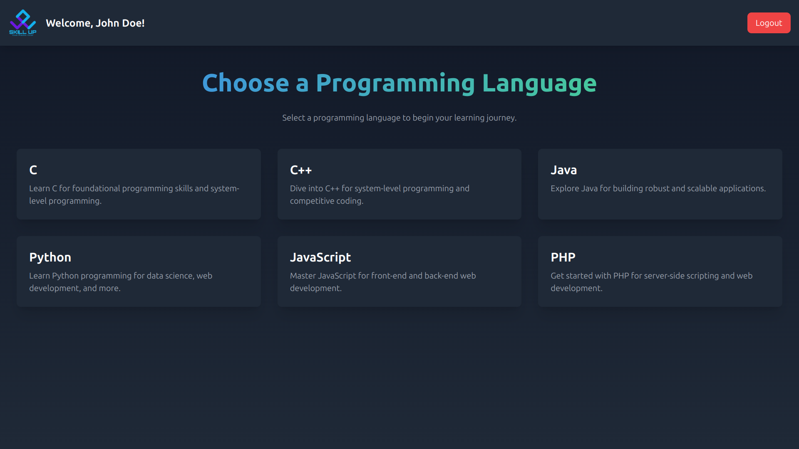
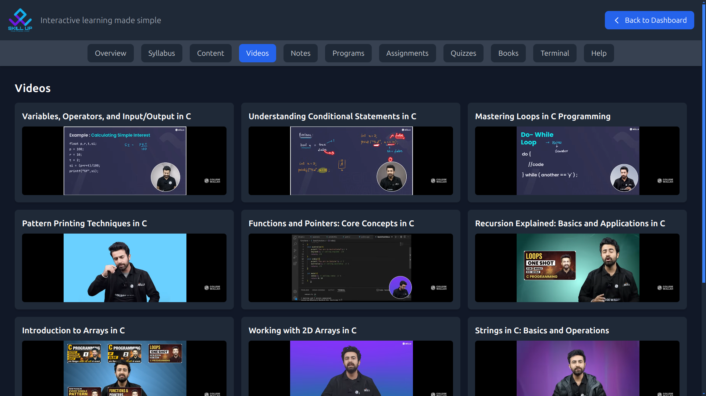
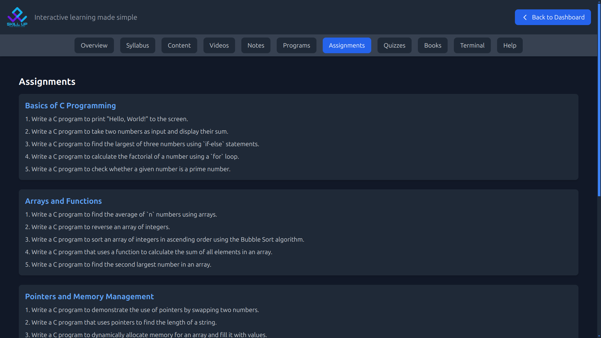
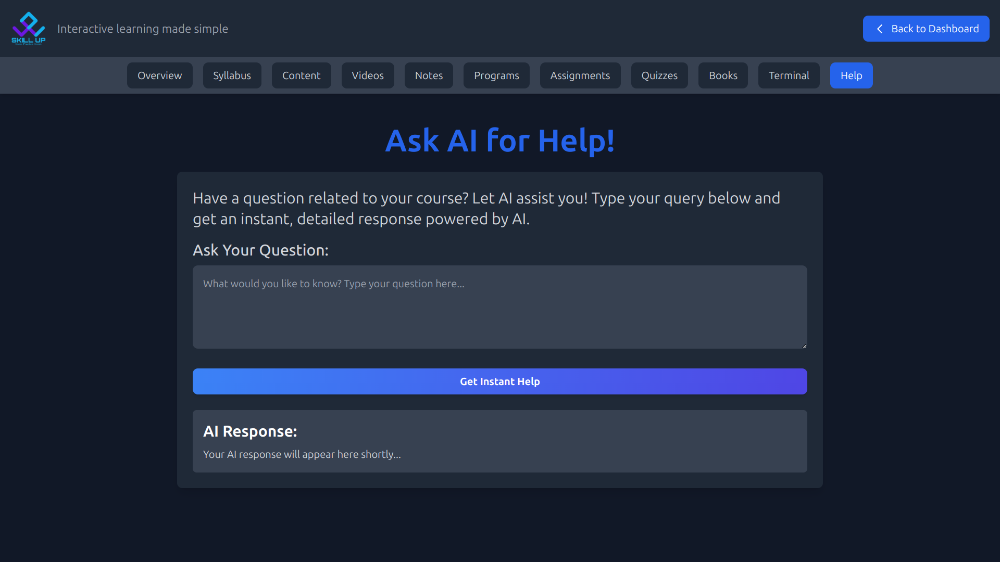

---

# **Skill Up**

The Skill Up Learning Platform is an advanced web application designed to enhance students'
programming skills through practical, hands-on exposure and interactive learning modules. The
platform is scalable, allowing for the inclusion of a wide variety of courses and catering to diverse
academic and professional learning needs.

---

## **Features**

### **Core Features**
- **Interactive Online IDE**: Practice programming directly in the browser.
- **Structured Exercises**: Programs and assignments designed for comprehensive skill development. 
- **Comprehensive Resources**:
  - Notes, videos, books, and programs for learning.
- **Assessments and Quizzes**: Test understanding and track progress.
- **Progress Tracking**: Analytics to monitor learning outcomes.
- **Terminal Integration**: Run code snippets seamlessly.

### **Additional Features**
- **Dark Aesthetic Theme**: Designed for an enhanced user experience.
- **Collaboration Tools**: Share code and collaborate in real-time.
- **Future Ready**: Scalable to include advanced features like AI-based code review and gamified learning.

---

## **Technologies Used**

### **Frontend**
- **React.js**: For building dynamic user interfaces.
- **Tailwind CSS**: For modern, responsive styling.

### **Backend**
- **Node.js with Express.js**: RESTful API development.

### **Database**
- **MongoDB**: For handling course, department, and user data.

### **Authentication**
- **OAuth2 / JWT**: Secure login and session management.

### **Version Control**
- **Git & GitHub**: For collaborative development.

### **Deployment**
- **Docker**: Containerized deployment.
- **Cloud Platform**: For hosting and scalability.

---

## **Project Structure**

```
IU-CodeLab/
├── client/               # Frontend code
│   ├── src/              # React source files
│   ├── public/           # Public assets
│   └── build/            # Production build files
├── server/               # Backend code
│   ├── models/           # Database models
│   ├── routes/           # API routes
│   ├── middleware/       # Middleware functions
│   └── server.js         # Entry point
├── database/             # Database initialization scripts
├── tests/                # Automated test cases
└── README.md             # Project documentation
```

---

## **Screenshots**

Explore IU CodeLab through the following key interface sections:

### 1. **Homepage**  
**Description**: The starting point of IU CodeLab, showcasing all available courses with a clean and user-friendly design for easy navigation.  
**Preview**:  


---

### 2. **Registration Page**  
**Description**: A user-friendly registration form to create an account and access the platform.  
**Preview**:  


---

### 3. **Login Page**  
**Description**: A secure login interface for returning users to access their personalized dashboard.  
**Preview**:  


---

### 4. **Dashboard**  
**Description**: The central hub for users to view enrolled courses, track progress, and access learning materials.  
**Preview**:  


---

### 5. **Course Overview**  
**Description**: A comprehensive overview of each course, providing easy access to syllabus, notes, programs, assignments, and more.  
**Preview**:  


---

### 6. **Syllabus Section**  
**Description**: A well-structured syllabus that outlines topics covered in the course, organized by weeks or sessions.  
**Preview**:  


---

### 7. **Content Section**  
**Description**: A repository of curated content, including resources, materials, and additional references for the course.  
**Preview**:  


---

### 8. **Videos Section**  
**Description**: A collection of tutorial videos to enhance learning and provide visual explanations of key concepts.  
**Preview**:  


---

### 9. **Notes Section**  
**Description**: Access to detailed lecture notes, organized by topics for quick reference.  
**Preview**:  


---

### 10. **Programs Tab**  
**Description**: A structured list of programming exercises aligned with the curriculum, categorized by topics and difficulty levels.  
**Preview**:  


---

### 11. **Assignments Tab**  
**Description**: A section where students can view and submit assignments for evaluation and feedback.  
**Preview**:  


---

### 12. **Quizzes Tab**  
**Description**: An interactive section featuring quizzes for self-assessment, with instant feedback and auto-grading functionality.  
**Preview**:  


---

### 13. **Books Section**  
**Description**: A curated list of recommended books and resources for further learning and in-depth study.  
**Preview**:  


---

### 14. **Terminal Integration**  
**Description**: A fully interactive terminal feature that enables students to write, compile, and run code snippets directly within the browser.  
**Preview**:  


---

### 15. **Help Section**  
**Description**: An AI-powered chatbot designed to assist users by answering queries, providing guidance, and offering quick solutions to issues related to the platform.  
**Preview**:  


---

## **Exceptional Features**  

### 1. **Stability**  
- Robust backend with error-handling mechanisms and rigorous testing.  
- Ensures a smooth user experience even under varying load conditions.  
- Handles unexpected user inputs gracefully without crashes.  

### 2. **High Scalability**  
- Designed to support a growing user base with optimized database queries and load-balanced APIs.  
- Modular architecture allows effortless horizontal scaling.  
- Easily extendable to new departments or institutions.  

### 3. **Maintainability**  
- Clean and well-documented codebase adhering to industry best practices.  
- Centralized configurations using `.env` files for easy updates.  
- Continuous Integration/Continuous Deployment (CI/CD) pipeline for seamless updates and testing.  

### 4. **Modularity**  
- Component-based frontend architecture with reusable React components.  
- Separate concerns in the backend with modular routes, models, and controllers.  
- Easy addition of new features or modules without affecting the existing code.  

---

## **System Architecture**  

The project follows a modular architecture pattern with clearly defined responsibilities:  

- **Frontend**: User interface and interactivity.  
- **Backend**: Business logic, API handling, and data processing.  
- **Database**: Persistent storage with optimized data models for fast retrieval.  

---

## **Advantages of the System Design**  

- **Resilience**: Can withstand high traffic and data volume.  
- **Flexibility**: New features can be integrated without disrupting existing functionality.  
- **Ease of Use**: Designed to be intuitive for students and educators.  

---

## **Getting Started**

### **Prerequisites**
- **Node.js** (v16+)
- **Git**
- **MongoDB**

### **Installation Steps**
1. **Clone the Repository**:
   ```bash
   git clone https://github.com/sahilahmad6569/IU-CodeLab.git
   cd IU-CodeLab
   ```

2. **Install Dependencies**:
   ```bash
   cd client
   npm install
   cd ../server
   npm install
   ```

3. **Set Environment Variables**:
   Create a `.env` file in the `server/` directory with the following content:
   ```
   MONGO_URI=<your_mongo_connection_string>
   JWT_SECRET=<your_secret_key>
   ```

4. **Start the Server**:
   ```bash
   cd server
   npm start
   ```

5. **Start the Frontend**:
   ```bash
   cd client
   npm start
   ```

6. **Access the App**:
   Open your browser and visit: `http://localhost:3000`

---

## **Roadmap**

### **Phase 1: MVP (Completed)**
- Core features including online IDE, syllabus integration, and progress tracking.

### **Phase 2: Enhancements**
- Add advanced features:
  - AI-based code reviews.
  - Real-time collaboration tools.
  - Gamified learning with leaderboards and badges.

### **Phase 3: Expansion**
- Scale the platform to other university departments and institutions.
- Develop a mobile app using Flutter.

---

## **Contribution Guidelines**

We welcome contributions from the community to make IU CodeLab even better! Follow these steps to contribute:

1. **Fork the Repository**:
   ```bash
   git fork https://github.com/sahilahmad6569/IU-CodeLab.git
   ```

2. **Create a New Branch**:
   ```bash
   git checkout -b feature-name
   ```

3. **Make Changes and Commit**:
   ```bash
   git commit -m "Add your feature"
   ```

4. **Push and Create a Pull Request**:
   ```bash
   git push origin feature-name
   ```

5. **Submit Your Pull Request**: Ensure it is linked to a related issue (if any).

---

## **Contact**

For any inquiries, feedback, or collaboration opportunities, feel free to reach out:

- **GitHub**: [github.com/sahilahmad6569](https://github.com/sahilahmad6569)  
- **Email**: [sahilahmad6569@gmail.com](mailto:sahilahmad6569@gmail.com)  
- **LinkedIn**: [linkedin.com/in/sahil-ahmad-dev](https://linkedin.com/in/sahil-ahmad-dev)  

---

## **License**

This project is licensed under the MIT License.  

---